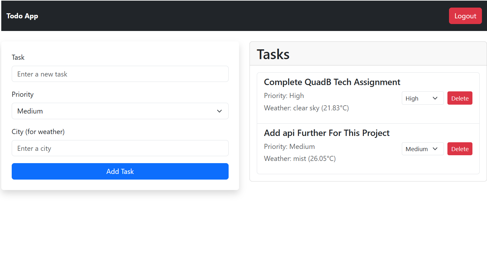

# Advanced To-Do App with Weather Integration

## Overview
This Advanced To-Do App is a responsive web application built using **React** and **Redux** for state management. The application features a clean design, simple user authentication, and integrates a weather API to display weather information based on user input.

---

## live Link
https://advance-to-do.netlify.app/login

## Features

### 1. **Add Task**
   - Create new tasks with a title, priority, and optional city to fetch weather data.

### 2. **View Task**
   - View a list of tasks with their associated priority and current weather conditions for the specified city.

### 3. **Delete Task**
   - Remove tasks easily with a delete button.

### 4. **Task Prioritization**
   - Assign priorities (e.g., High, Medium, Low) to tasks and adjust them dynamically.

### 5. **Weather Integration**
   - Get real-time weather updates for tasks based on the city entered.

### 6. **User Authentication**
   - Simulated login/logout functionality using Redux for state management.
   - Default credentials:
     - **Username:** admin
     - **Password:** password

### 7. **Persistent Storage**
   - Tasks and user session data are saved persistently using local storage.

---

## Technologies Used

- **Frontend Framework:** React.js
- **State Management:** Redux
- **Styling:** Bootstrap (Mobile-First Approach)
- **Weather API:** OpenWeatherMap API (or similar for fetching weather data)
- **Authentication:** Redux-simulated login/logout

---

## Installation & Setup

1. Clone the repository:
   ```bash
   git clone <repository-url>
   ```

2. Navigate to the project directory:
   ```bash
   cd advanced-todo-app
   ```

3. Install dependencies:
   ```bash
   npm install
   ```

4. Start the development server:
   ```bash
   npm start
   ```

5. Open your browser and navigate to:
   ```
   http://localhost:3000
   ```

---

## Usage

1. **Login**:
   - Enter the credentials (**Username:** admin, **Password:** password) to log in.

2. **Add a Task**:
   - Enter the task details (title, priority, and city for weather data).
   - Click the **Add Task** button to save the task.

3. **View Tasks**:
   - All added tasks are listed under the "Tasks" section.
   - Each task shows its priority and current weather.

4. **Edit or Delete Tasks**:
   - Adjust task priorities or delete tasks as needed.

5. **Logout**:
   - Click the **Logout** button to simulate logging out.

---

## Screenshots

### Application Interface:


---

## Responsive Design

This application is built with a **mobile-first approach** using Bootstrap. The layout adjusts seamlessly for mobile, tablet, and desktop screens.

---

## Future Enhancements

- Add a feature to edit tasks.
- Improve weather API error handling.
- Implement backend authentication with a database.
- Add task filtering and sorting options.

---


## Contributions

Feel free to fork this repository and submit pull requests for any improvements or bug fixes.

---

**Enjoy managing your tasks efficiently with this Advanced To-Do App!**
